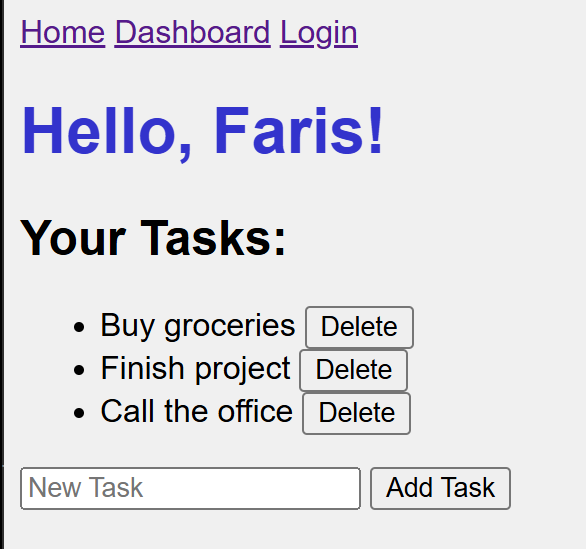
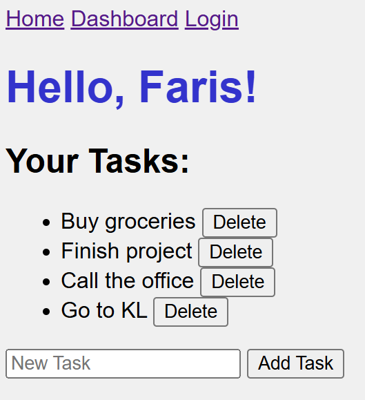

# Task Manager - Version 1


A simple **task manager web application** built with **FastAPI** and **Jinja2 templates**, allowing users to view, add, and delete tasks.

> **Note:** Version 1 does **not** include user authentication or login functionality yet.

---

## Features

- Display a list of tasks
- Add new tasks via a form
- Delete tasks from the list
- Responsive layout using CSS
- Templates powered by **Jinja2**

---

## Project Structure

```
.
├── CHANGELOG.md
├── LICENSE
├── README.md
├── app
│   ├── main.py
│   ├── static
│   │   ├── script.js
│   │   └── styles.css
│   └── templates
│       ├── base.html
│       ├── dashboard.html
│       ├── index.html
│       └── login.html
└── requirements.txt

```

## Technologies Used

- Python 3.12
- FastAPI - Backend web framework
- Jinja2 - Template engine
- HTML/CSS - Frontend
- Uvicorn - ASGI server for development

## Setup Instructions

1. **Clone the repository**:

```bash
git clone <your-repo-url>
cd task-manager-project-dashboard
```

2. **Create and activate a virtual environment:**

```
python -m venv .venv
source .venv/bin/activate   # Linux/macOS
.venv\Scripts\activate      # Windows
```

3. **Install dependencies:**

```
pip install -r requirements.txt
```

4. **Run the application:**

```
uvicorn app.main:app --reload
```

5. **Open in your browser:**

```
http://127.0.0.1:8000/
```

## Usage

- View tasks:
  
- Add a task:
  
- Added task:
  
- Add another task:
  
- Delete a task:
  

- Styling is minimal via styles.css
- script.js, login.html & dashboard.html are empty for future enhancements
